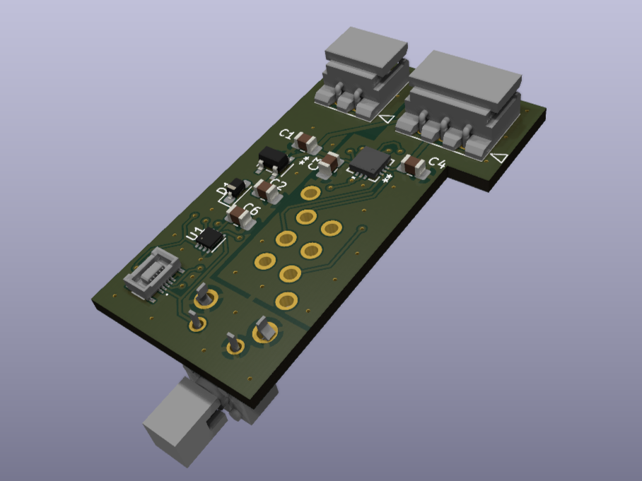
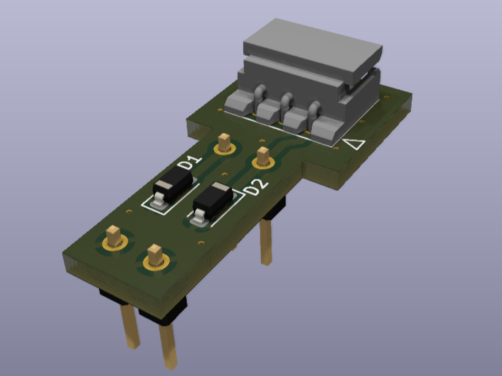

# Marshall-MG15CD-footswitch-modification-board

This Repository contains PCB design files from KiCAD and source code for modifying Marshall MG15CDR combo guitar amplifier.

## About

Old combo guitar amplifier; Marshall MG15CD, MG15CDR, MG15DFX has 2 Channel; Clean and OD (Overdrive). The amplifier doesn't have footswitch functionality for Channel, Reverb and etc. unlike it's bigger and pricier counterparts.   
   
To give little more life to this good old amplifier, I've designed add-on modification boards to add channel foot-switching functionality by using ATtiny4 MCU.

## controller-board

The board for channel switching. It is powered from the **_power-board_**.     

After remove the old channel switch, the board can be installed to amplifier using [DW-01-09-T-S-450](https://www.samtec.com/products/dw-01-09-t-s-450) Board Stacking Headers (adjust post height to 10.5mm).

The MCU can be programmed through [DF40B-10DS-0.4V(58)](https://www.hirose.com/en/product/p/CL0684-4038-8-58) Board-to-Board Connector. If you're finding mating connector's adaptor board, look [my other repository](https://github.com/masope/DF40C-10DP-0.4V-adaptor).

After installation, you can switch between Clean and OD channels using both on-board tactile switch or external footswitch (I recommend unlatch-type switch like "FS-5U"). You might can make a 1/4" jack footswitch connecter to rear side of a chassis or connect footswitch directly to a on-board 2-pin connector both using [50375023](https://www.molex.com/en-us/products/part-detail/50375023). 

## power-board

The Dual 15V Power can be tapped-off from the amplifier's main board.

After remove the Z2, Z3 from the amplifier, install this board.